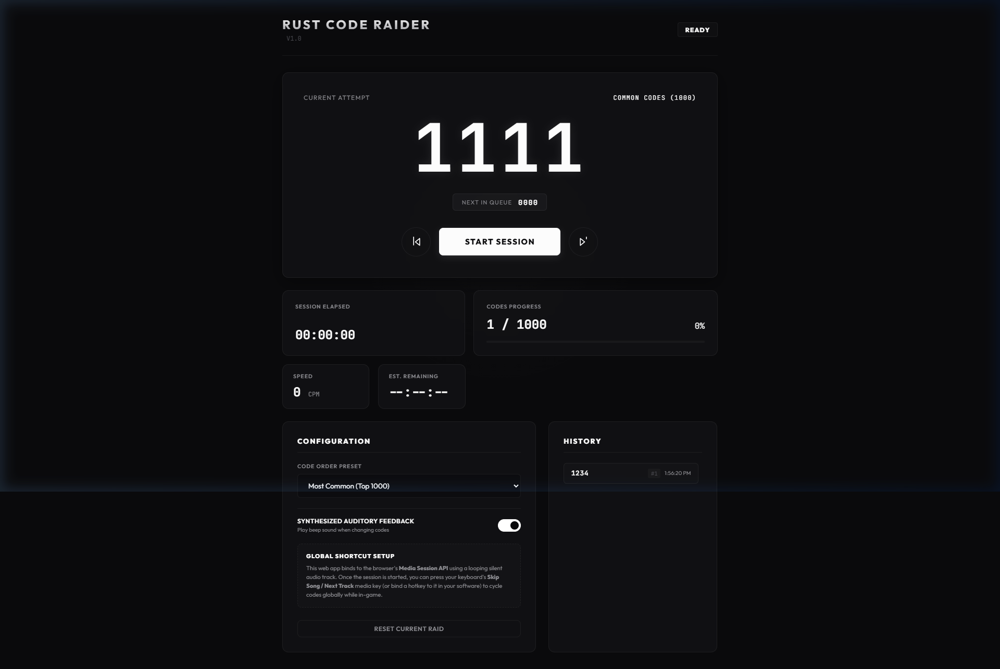
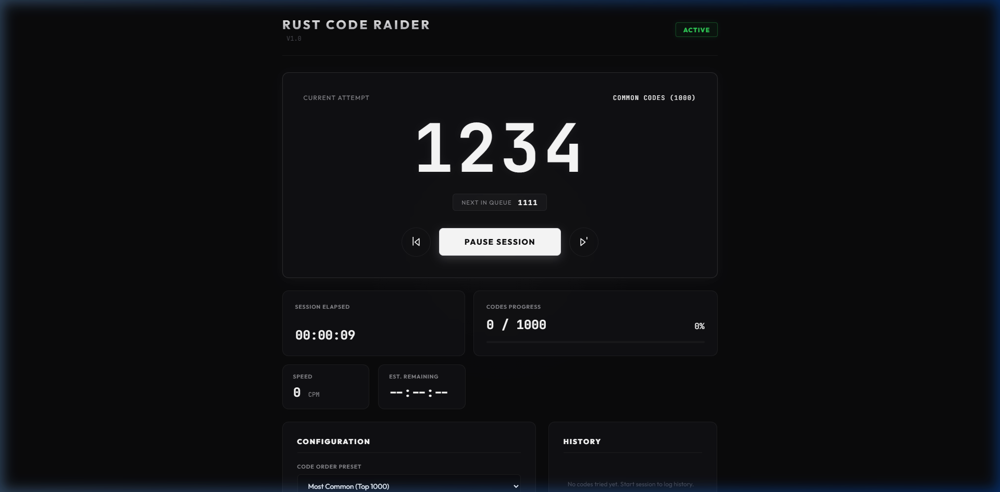

# Rust Code Raider

A modern, minimalist web assistant for manually code raiding base locks in Rust. It runs completely client-side in your browser and maps to global OS keyboard media shortcuts (Next Track, Previous Track) to swap codes while you are playing in-game on a single or second monitor.

## Features

- **Top 10,000 Common Codes Preset**: Loaded with every possible 4-digit code combination (0000 - 9999) sorted by actual statistical frequency, so you try the most common patterns first.
- **Top 1000 Subset**: An option to run through just the top 1000 most common codes.
- **Sequential Preset**: Try all 10,000 combinations sequentially from 0000 to 9999.
- **Custom Queues**: Paste your own custom code list, one per line.
- **Global Key Hooking**: Integrates with the browser's Media Session API using a looping silent audio track to intercept background media key presses.
- **Auditory Feedback**: Generates synthesized key-click sounds using Web Audio API oscillators when swapping codes, confirming the transition when tabbed out.
- **Stats Dashboard**: Displays current raid session timer, average speed (Codes Per Minute), progress metrics, and Estimated Time remaining.
- **Raid Log History**: Shows a running list of recently attempted codes for quick review.

## Why This Is EAC Safe

This tool is 100% external and safe from Easy Anti-Cheat (EAC) bans:
1. It runs in a standard browser tab.
2. It does not read/write game memory or inject DLLs.
3. It does not automate keyboard or mouse clicks inside the Rust game window. You manually type the code into the lock in-game; the tool only tracks the checklist.

## Getting Started

1. Download the repository files to your computer.
2. Double-click `index.html` to open it in any web browser.
3. Under **Configuration**, choose your preferred **Code Order Preset**.
4. Click the **START SESSION** button to initialize the audio track and media controls hook.
5. While playing Rust, press the **Next Track / Skip Song** button on your keyboard or mouse macro key to advance through the codes.

## Logitech G Hub / Mouse Macro Binding

To bind a mouse button to swap codes:
1. Open Logitech G Hub.
2. Select your active mouse profile.
3. Go to **Assignments** -> **Keys** or **System**.
4. Drag the **Next Track** action to your preferred mouse key (e.g. side button).
5. Once **START SESSION** is active in the web page, pressing that button in-game will cycle the code lock digits on your screen.
